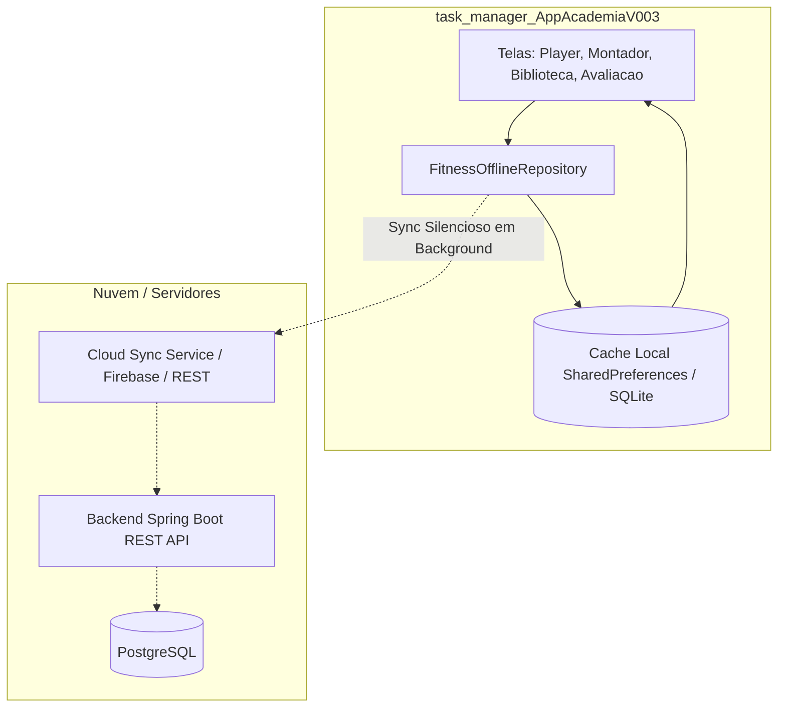

# 📋 Roadmap Estratégico & Plano de Evolução: AppAcademia V003
> **Transformação em Solução Fitness Completa (Padrão MFIT Personal & MyFitCoach)**  
> **Estratégia:** Foco Exclusivo em **Mobile & Web** + Atuação **UX-Design & UI-Pro-Max** + Arquitetura Offline-First (Local Cache & Cloud Sync)  
> **Identidade Visual:** Padrão MFIT Personal com Nova Tonalidade de Alta Performance (**Cyber Emerald & Slate Obsidian**)  
> **Data:** Outubro de 2026 | **Foco:** `task_manager_AppAcademiaV003` (Flutter) | **Backend Spring Boot:** 100% Intacto

---

## 🎨 1. Diretrizes de Design (UX-Design & UI-Pro-Max)

Diretriz central do projeto:
> *"O foco é só mobile e web, padrão mfit-personal mudando apenas a tonalidade das cores, mantendo alta performance, fluidez e usabilidade profissional para alunos e personais."*

### 1.1. Nova Tonalidade de Cores (Emerald Pro & Slate Obsidian)
Em vez do tom laranja/coral padrão do MFIT, adotamos uma paleta atlética moderna de alta conversão e legibilidade (padrão Whoop, Strava e Apple Fitness):

- **Primary / Destaque de Ação:** `Color(0xFF059669)` (Emerald Pro 600 - energia, saúde, progresso de carga);
- **Primary Subtle / Indicador Ativo:** `Color(0xFFECFDF5)` (Emerald 50 - contraste suave para botões e menus selecionados);
- **Secondary / Metas & Badges:** `Color(0xFFF59E0B)` (Amber Gold - conquistas, streaks, atenção);
- **Background / Superfície:** `Color(0xFFF8FAFC)` (Slate 50 - fundo limpo, relaxante e moderno);
- **Cards & Diálogos:** `Color(0xFFFFFFFF)` (Branco puro com bordas arredondadas de 16px e sombra difusa);
- **Tipografia:** `Color(0xFF0F172A)` (Slate 900 - contraste nítido e legibilidade máxima WCAG AAA) com fonte Google Fonts Poppins;
- **Labels Secundários:** `Color(0xFF64748B)` (Slate 500).

### 1.2. Experiência Multiplataforma (Mobile & Web)
1. **No Mobile (`largura < 800px`):**
   - Barra de navegação inferior (`NavigationBar`) com 5 destinos alinhados ao MFIT: **Início**, **Alunos**, **Treinos**, **Atividade** e **Mais**.
   - Interações fluidas com toque amplo (mínimo 44px), bottom sheets retráteis e feedback visual tátil.
2. **Na Web / Desktop (`largura >= 800px`):**
   - Barra de navegação lateral (`NavigationRail`) fixa à esquerda com logotipo, ícones e rótulos.
   - Conteúdo centralizado com largura máxima responsiva (`maxWidth: 1200`), eliminando o aspecto de "tela de celular esticada" e proporcionando a sensação de um painel web profissional de personal trainer.

---

## ✂️ 2. O Que Foi Removido do Frontend (Desacoplamento do Legado ERP)

> ⚠️ **Backend Preservado:** Nenhuma linha do backend Spring Boot foi alterada. Todos os endpoints e modelos continuam íntegros.

Foram removidos com sucesso **35 arquivos de telas e widgets órfãos do ERP contábil**, sem nenhum impacto ou quebra no restante do aplicativo:

| Categoria | Arquivos Removidos (`lib/ui/screens/` e `lib/ui/widgets/`) | Status |
| :--- | :--- | :--- |
| **Financeiro Contábil ERP** | • `conta_pagar_grid_screen.dart`<br>• `conta_receber_grid_screen.dart`<br>• `contas_receber_grid_screen.dart`<br>• `conta_bancaria_grid_screen.dart`<br>• `baixa_dialog.dart`<br>• `baixa_dialog_receber.dart`<br>• `desfazer_baixa_dialog.dart`<br>• `cotacao_grafico_screen.dart` | ✅ Removido |
| **Dashboards Financeiros ERP** | • `dashboard_finance_fluxo_diario_screen.dart`<br>• `dashboard_finance_trend_screen.dart`<br>• `dashboard_quarterly_screen.dart`<br>• `dashboard_client_distribution_screen.dart`<br>• `dashboard_contas_balances_screen.dart`<br>• `dashboard_conta_evolucao_screen.dart`<br>• `dashboard_alerts_screen.dart`<br>• `dashboard_kpis_screen.dart`<br>• `dashboard_screen.dart` | ✅ Removido |
| **Negociação & Vendas B2B** | • `negociacao_screen.dart`<br>• `custom_negociacao_box_form.dart`<br>• `negociacao_core.dart`<br>• `negotiationDialog.dart`<br>• `envio_contrato_core.dart`<br>• `vendas_screen.dart` | ✅ Removido |
| **E-commerce & Carrinho Genérico** | • `carrinho_compras_screen.dart`<br>• `carrinho_vendas_screen.dart`<br>• `checkoutScreen.dart`<br>• `freteWidget.dart`<br>• `product_register_screen.dart`<br>• `ProdutoDetailsScreen.dart` | ✅ Removido |
| **Ponto Eletrônico & RH Contábil** | • `ponto_screen.dart`<br>• `empresa_edit_screen.dart`<br>• `parceiro_grid_screen.dart`<br>• `parceiro_edit_screen.dart` | ✅ Removido |
| **Chamados / Helpdesk TI** | • `chamado_grid_screen.dart`<br>• `chamado_grid_screen_dynamic.dart`<br>• `chamados_popups.dart`<br>• `atribuir_chamado_dialog.dart`<br>• `historico_chamado_dialog.dart`<br>• `ticket_form_bottom_sheet.dart`<br>• `dashboard_tickets_trend_screen.dart` | ✅ Removido |
| **Exemplos e Testes Abandonados** | • `file_attachment_grid_screen.dart`<br>• `documento_screen.dart`<br>• `range_example.dart`<br>• `table_calendar_base.dart`<br>• `system_test_screen.dart`<br>• `custom_dieta_box_form copy.dart` | ✅ Removido |

---

## 🚀 3. Funcionalidades Fitness Implementadas (Padrão MFIT Personal & MyFitCoach)

### 3.1. Gestão do Personal Trainer (MFIT Personal)
1. **Montador Visual de Treinos (`montador_treino_screen.dart`):**
   - Criação de divisões clássicas: Treino A, B, C, D, E ou agrupamentos personalizados (ex: Peitoral e Tríceps, Quadríceps e Glúteos).
   - Inclusão rápida de exercícios com busca inteligente por grupo muscular.
   - Configuração de: Séries, Repetições (ou faixa: ex: 8 a 12), Carga inicial (kg), RPE/RIR (esforço percebido), Intervalo de descanso (segundos).
   - Técnicas avançadas configuráveis em 1 clique: Bi-set, Tri-set, Drop-set, Rest-pause, Pirâmide crescente/decrescente.
2. **Templates e Duplicação de Treino:**
   - Salvar treinos como "Modelos/Templates" (ex: "Hipertrofia Iniciante 3x", "Emagrecimento Feminino").
   - Atribuir o mesmo modelo para múltiplos alunos ou duplicar um treino existente alterando apenas cargas.
3. **Biblioteca de Exercícios com Mídia Integrada (`biblioteca_exercicios_screen.dart`):**
   - Catálogo completo pré-carregado com dezenas de exercícios organizados por grupo muscular (Peitoral, Costas, Pernas, Ombros, Bíceps, Tríceps, Abdômen, Cárdio).
   - Demonstração em vídeo/GIF curto com execução anatômica correta.
   - Possibilidade do Personal adicionar novos exercícios customizados com URLs de vídeo/mídia.
4. **Avaliação Física Protocolada (`avaliacao_fisica_pro_screen.dart`):**
   - Dobras cutâneas com protocolos científicos: **Pollock 3 dobras**, **Pollock 7 dobras**, **Petroski**, **Guedes**.
   - Cálculo automático de % de Gordura, Massa Magra (kg), Massa Gorda (kg) e Peso Ideal.
   - Perimetria Corporal completa (pescoço, ombro, tórax, braços, antebraços, cintura, abdômen, quadril, coxas e panturrilhas).
   - Avaliação Postural com fotos padronizadas (Frente, Costas, Lateral Direita, Lateral Esquerda) e comparador visual.

### 3.2. Experiência do Aluno e Inteligência de Treino (MyFitCoach)
1. **Player de Treino ao Vivo (`player_treino_ao_vivo_screen.dart`):**
   - Modo escuro esportivo de alto contraste, tipografia grande para leitura à distância no salão de musculação.
   - Banner com instruções anatômicas e vídeo de execução no topo.
   - Checkbox por série concluída: registro instantâneo de carga real (kg) e repetições executadas.
   - Histórico da última carga usada visível para guiar a sobrecarga progressiva contínua.
2. **Cronômetro de Descanso Inteligente:**
   - Disparo automático ao marcar qualquer série como concluída.
   - Alertas visuais com barra de progresso regressiva e botões rápidos (+15s / -15s).
3. **Substituição de Exercício no Salão:**
   - Botão "Aparelho ocupado? Substituir exercício": lista sugestões anatômicas equivalentes do mesmo grupo muscular.
4. **Feedback de Fim de Treino & Métricas:**
   - Questionário de percepção subjetiva de esforço (RPE 1 a 10).
   - Cálculo automático de tonelagem total da sessão (**Volume Load = Séries × Repetições × Peso**).
   - Modal de comemoração de treino batido e streak de consistência.

---

## ⚡ 4. Arquitetura Offline-First & Sincronização Híbrida

### 4.1. Camada de Repositório (`FitnessOfflineRepository`)
O `FitnessOfflineRepository` implementa o padrão *Offline-First* garantindo que nenhuma ação do aluno ou personal trainer dependa de conexão ativa com a internet para ser executada:



### 4.2. Regras de Resiliência Offline:
1. **Execução 100% Desconectada:** O aluno pode abrir a ficha, iniciar o player, registrar séries, pesos, repetições e finalizar o treino mesmo sem sinal de internet ou no modo avião.
2. **Seed Local Automático:** No primeiro uso, o catálogo completo de exercícios e fichas modelo é gerado localmente de forma instantânea.
3. **Sincronização em Segundo Plano:** Quando a conectividade é restabelecida, os registros acumulados são enviados para persistência remota sem interromper a navegação do usuário.

---

## 📁 5. Estrutura de Arquivos do Módulo Fitness (V003)

```
task_manager_AppAcademiaV003/lib/
├── app.dart                                      # Configuração de temas (GridColors), rotas e navegação global
├── data/
│   ├── constants/
│   │   └── custom_colors.dart                    # Design system central: Cyber Emerald & Slate Obsidian
│   ├── models/
│   │   └── fitness/
│   │       ├── exercicio_model.dart              # Modelo de exercício com mídias e grupos musculares
│   │       ├── plano_treino_model.dart           # Fichas de treino, divisões (A/B/C/D) e séries
│   │       └── sessao_treino_registro_model.dart # Histórico de execuções reais, cargas e RPE
│   └── services/
│       ├── fitness_offline_repository.dart       # Repositório Offline-First com persistência local
│       └── fitness_360_local_store.dart          # Store local auxiliar
└── ui/
    └── screens/
        ├── bottom_navbar_screen.dart             # Barra de navegação adaptativa (NavigationBar mobile / NavigationRail web)
        └── fitness/
            ├── treinos_hub_screen.dart           # Hub principal com fichas, métricas e atalhos rápidos
            ├── montador_treino_screen.dart       # Montador visual de fichas para personal trainers
            ├── biblioteca_exercicios_screen.dart # Catálogo de exercícios com filtros e buscas
            ├── player_treino_ao_vivo_screen.dart # Player de execução de treino em tempo real do aluno
            └── avaliacao_fisica_pro_screen.dart  # Avaliação física com protocolos de dobras e perimetria
```

---

## 📅 6. Status do Cronograma por Fases

| Fase | Descrição | Status | Detalhes |
| :---: | :--- | :---: | :--- |
| **Fase 1** | **Limpeza do Frontend & Desacoplamento do Legado ERP** | ✅ **Concluída** | 35 telas e widgets de contabilidade/ERP removidos; `bottom_navbar_screen.dart` reestruturado nas 5 abas do MFIT com NavigationRail para Web e NavigationBar para Mobile; Design System Emerald Pro atualizado em `custom_colors.dart` e `app.dart`. |
| **Fase 2** | **Infraestrutura e Repositório Offline-First** | ✅ **Concluída** | Implementado `FitnessOfflineRepository` com persistência local de exercícios, treinos, divisões e sessões finalizadas com resiliência a quedas de rede. |
| **Fase 3** | **Biblioteca de Exercícios & Montador de Treino (MFIT Core)** | ✅ **Concluída** | `montador_treino_screen.dart` e `biblioteca_exercicios_screen.dart` implementados com suporte a divisões A/B/C/D, busca inteligente, seleção de técnicas avançadas e criação de novos exercícios. |
| **Fase 4** | **Player de Treino do Aluno (MyFitCoach Live Mode)** | ✅ **Concluída** | `player_treino_ao_vivo_screen.dart` implementado com cronômetro automático de descanso, substituição de aparelho no salão, registro de carga real e tonelagem total. |
| **Fase 5** | **Avaliação Física, Protocolos de Dobras & Medidas** | ✅ **Concluída** | `avaliacao_fisica_pro_screen.dart` implementada com Pollock 3 e 7 dobras, Petroski, medidas corporais completas e comparação postural. |
| **Fase 6** | **Notificações Push, Polimento de UI & Validação Final** | 📋 **Em Andamento** | Ajustes finos de micro-animações, feedback tátil no mobile, push notifications de lembrete de treino e testes automatizados de paridade web/mobile. |

---

## 🛡️ 7. Diretrizes de Manutenção e Menor Impacto

1. **Backend Spring Boot 100% Intacto:** Nenhuma alteração é permitida no backend para fins exclusivos do frontend sem especificação prévia.
2. **Princípio do Menor Diff:** Modificações devem ser cirúrgicas, reutilizando os componentes e modelos existentes.
3. **Commit Exclusivo em `desenv`:** Conforme diretrizes do projeto, todo o trabalho de desenvolvimento e evolução deve ser versionado na branch `desenv`.
